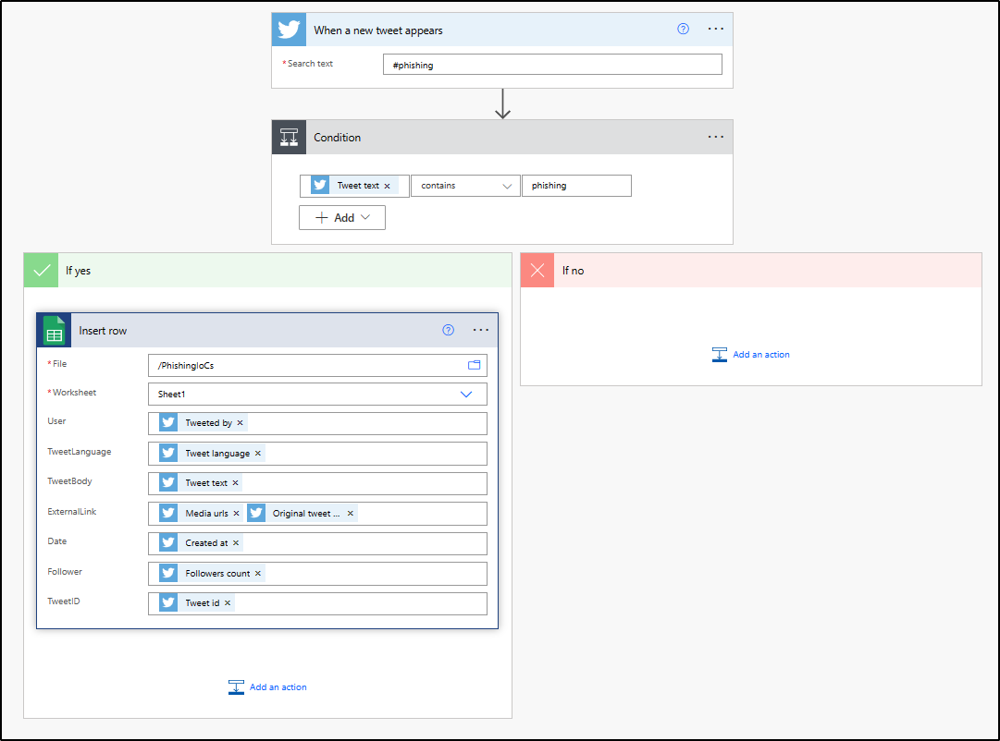

# Twitter Phishing IoCs to MISP
The project consist of extracting Phishing IoCs (Indicator of Compromise) from Twitter and add them to MISP Instance.

Here's some figures that represent the Types of IoCs extracted from Twitter and The top TLDs.

**Timestamp:** 1681835704


## Installation

Use the package manager [pip](https://pip.pypa.io/en/stable/) to install (pandas, gspread, pymisp, plotly).

```bash
pip install pandas gspread pymisp plotly
```

## Configuration and Steps to Reproduce

1. Create a PowerAutomate Workflow From *'Save a Tweets to a Google Sheet'* Template


2. Configure a Google Cloud service to interact with the Google Sheet from the Python code.
3. Create an *Authentification Key* bound to the Publisher MISP user. 
4. Clone https://github.com/Reda-BELHAJ/TweetPhishingIoCsMISP and run it Locally.

## Contributing

Pull requests are welcome. For major changes, please open an issue first to discuss what you would like to change.

Please make sure to update tests as appropriate.
